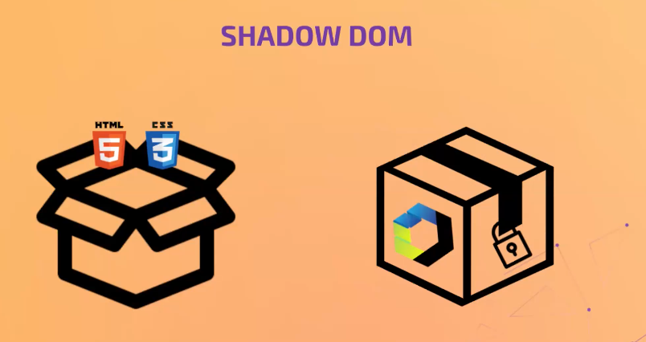

Un componente sin `shadow dom` se puede acceder a cambiar su css o html desde fuera, es decir, podríamos cambair los colores añadiendo un script pot ejemplo en el cuerpo del .html. Pero, con shadow dom nunca puedes acceder a cambiar la estructura del css y html.

Nuestro código parete de la solucion de 1.3

```js
class DigitalClock extends HTMLElement {
  
  constructor() {
    super();
  }

  connectedCallback() {
    console.log('<------- connectedCalback ----->');

    setInterval(() => { // permite ejecutar una funcion n veces cada un periodo de tiempo
      const now = new Date();
      const hours = now.getHours();
      const minutes = now.getMinutes();
      const seconds = now.getSeconds();
  
      this.innerHTML = `<h2>${hours} : ${minutes} : ${seconds}</h2>`;
    }, 1000);
    
  }
}

window.customElements.define('digital-clock', DigitalClock);
```
---

¿cómo hacemos que nuestro componente tenga `whadow down`?

```js
  constructor() {
    super();
    // esto hace que tengamos shadow dom
    this.attachShadow({ mode: 'open' });
  }
```

de esta forma vamos a permitir que tengamos acceso desde fuera al interior del web component siempre que o permitamos. Esta linea ya no funciona: 

```js
//  this.innerHTML = `<h2>${hours} : ${minutes} : ${seconds}</h2>`;
this.shadowRoot.innerHTML = `<span>${hours} : ${minutes} : ${seconds}</span>`;
```

quedaría así

```js
class DigitalClock extends HTMLElement {
  
  constructor() {
    super();

    this.attachShadow({ mode: 'open' });
  }

  connectedCallback() {


    setInterval(() => {
      const now = new Date();
      const hours = now.getHours();
      const minutes = now.getMinutes();
      const seconds = now.getSeconds();

      this.shadowRoot.innerHTML = `<span>${hours} : ${minutes} : ${seconds}</span>`;
    
  }
}
  
  window.customElements.define('digital-clock', DigitalClock);
```


---

**Variables nativas**: como desde fuera podemos modificar sus estilos desde fuera del web component?


Creamos una etiqueta template.


```js
const template = document.createElement('template');
```
 A este temp levamos hacer un innnerHTML y ahí dentro vamos a meter tdos los html y los estyles de web component para que todo quede en una pieza. Y que cuando tu importe el modulo de js de tu WC ahí esté todo, el template, los estiles, la lógica y esté el registro de tu WebComponent a nivel de navegador.

 ```js
const template = document.createElement('template');

template.innerHTML = `
  <style>
    h2 {
      color: var(--digital-clock-color, orangered);
    }
  </style>

  <h2></h2>
`;
 ```

 El h2 vacío porque ese h2 en el `connectedCallback()` le voy a pinchar la hora.

```js
  connectedCallback() {

    // hacemos un clon
    const templateClone = template.content.cloneNode(true); // true para que haga copia profunda si es anidada
    
    // ahora templateClone es un nodo, lo enchufamos en el dom del componente
    this.shadowRoot.appendChild(templateClone);

    setInterval(() => {
      const now = new Date();
      const hours = now.getHours();
      const minutes = now.getMinutes();
      const seconds = now.getSeconds();
      
      // seleccionamos el h2 del templateClone y le inyectamos el contenido
      this.shadowRoot.querySelector('h2').textContent = `${hours} : ${minutes} : ${seconds}`;
    }, 1000);
    
  }
```

Y en definitiva todo quedaría así

```js

const template = document.createElement('template');

template.innerHTML = `
  <style>
    h2 {
      color: var(--digital-clock-color, orangered);
    }
  </style>

  <h2></h2>
`;


class DigitalClock extends HTMLElement {
  
  constructor() {
    super();

    this.attachShadow({ mode: 'open' });
  }

  connectedCallback() {
    
    const templateClone = template.content.cloneNode(true);

    this.shadowRoot.appendChild(templateClone);

    setInterval(() => {
      const now = new Date();
      const hours = now.getHours();
      const minutes = now.getMinutes();
      const seconds = now.getSeconds();

      this.shadowRoot.querySelector('h2').textContent = `${hours} : ${minutes} : ${seconds}`;
    }, 1000);
    
  }
}
  
  window.customElements.define('digital-clock', DigitalClock);

```

Ahora el selector está siendo afectado y está escrito dentro de nuestro componente.

---

**custom propertis** o variable css. Vamos a ver como afectar desde fuera si se lo permitimos. Vamos a definir cosas para permitir que cambien estiles de mi componente.


Para trabajar con variables `css` hemos de saber como se definen y como se usan.

 * definir : `var()` metodo de css que permite aser uso de una variable de la custom porperty.
 * hacer uso de la variable : `var(--digital-clock-color)` le defino , me la invento.

Dentro del componente uno puede decir, vamos a utilizar el valor que tenga la variable `--digital-clock-color` ; por lo tanto si alguien fuera del componente ha definido esa variable, entonces nosotros lo pintaremos de ese color.

El método `var` te permite el valor de la `custom porperty` que estamos usando y segundo el valor que se va a usar si esa `custom porperty` no existe. Por ejmpo quieres que h2 por defecto se orange, a no ser que alguien defina ese valor para la variable.

¿cómo le damos valor? Para inicializar el valor hay que hacerlo dentro de una pseudo clase que es `::root` y dentro inicializamos el valor dela cutomproporty.

```js
const template = document.createElement('template');

template.innerHTML = `
  <style>
    ::root{
        h2 {
            color: var(--digital-clock-color), orange);
        }
    }
  </style>

  <h2></h2>
`;
```

Entonces cuando hacemos uso de la posibilidad de cambiar ese color desde fuera, yo utilizo la varibale en el html


Y para saltarme el `shadown dom` utilizo la custom porperty que ha puesto a mi disposicion, pues en la pseudo ::root defino un valor a la varibale

```html
<title>digital-clock WC</title>
<style>

    :root {
        --digital-clock-color: green;
    }

</style>
```

Incluso lo podrías definir en un fichero a parte. Las variables css son muy potentes y se pueden cambiar en tiempo de ejecucion. https://css-tricks.com/


