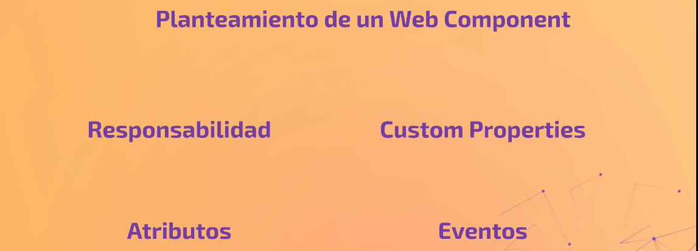
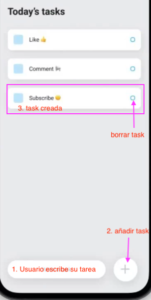

No hay que caer en el absurde de querer hacer un componente por cada HTML que veamos. Tampoco mega componetes grndes, porque cuando más grande sea o más cosas haga, menos reutilizable va a ser.

Un WC ¿qué problema queremos resolver? ¿por cuantos problemitas lo podemos resolver? Hemos de partir la pieza grande en problemitas independientes que son independientes entre ellas pero que juntas resuelven el problmea grande.


<span style="color:red">Cuando programes, tu valor será pensar, no picar codigo. Que la solución que des sea la valida para el problema a resolver. </span>

Tenemos que hacer 4 preguntas, tener claro 4 cosas
* Responsabilidad : ¿porqué quiero hacer ese WC?
Comunicación:
* Atributios: qué atributos recibe para que sea capaz de adaptarse a otros ecosistemas
* Aventos: Qué eventos, cuándo ha de emitir información hacia fuera de lo que le ocurre dentro.
* Custom Propertis: qué varibales css pondremos a disposición a los usuario para que puedan modificar.



Todo este proceso de responder estas preguntas se llama **DISEÑO TÉCNICO** y no sirve de nada ni tienes valor hasta que lo hagas antes de ponerte a picar codigo.

---


`TO DO LIST` Cosas a hacer para crear esto con web-componenets




* tenemos un imput de texto donde el usuario podrá escribir. (write a task)
* un button que cuando lo pulsemos se tiene que añadir un elemento nuevo.
* En nuestro listado de `to do` tendremos lo que hay en la foto, una vez el usuario a apretado el btón crear, tendremos una caja nueva con un texto que es, lo que tenemos que hacer, la task y a la derecha un botón para borrarlo
* Si le damos al boton el todo se borrará
* Como logica adicional cuando el usuario le da al botón crear task , tiene que vaciarse el imput.
* Si no rellenamos nada y le damos al botón task, no se debe crear un to do nuevo.

**¿por dónde empezamos?**

Comenzaremos por que el imput y el botón vayan juntos dentro de un web-component, porque ahí hay cierta lógica que  me interesa que sea la responsabilidad de ese web-component. Es decir. voy a tener un WC que se encarga de tener el `to do` que tenemos que añadir en la parte del listado de tareas. La siguiente lógica es que si el usuario aprieta el botún crear se vacíe la caja del imput, pero si el botón se pusla sin que haya escrito nada en el imput no podemos permitir que ese `to do` vacío se añada. 

¿como se llama ese componente?

Cuando más listo es un WC más capacidad de hacer cosas concretas y menos genérico será, menos lo podré reutilizar en diferentes sitios.

Siempre tendremos 2 tipos de WC, el que podamos reutilizar mucho, el que no podamos. Cuanto más podamos reutilzar el componente más generico debe ser su nombre. El WC que queremos hacr recoje un texto y tiene cierta lógica de imput, por ejemplo lo podríamos usar en la cabecera de la app de wallapop ¿verías sentido que se llame `addTask` se podría reutilizar en wallapop o el cien apps diferentes como buscador de peliculas de netflix? Cuanto más generico más jodido ponerle el nombre. Le llamaré por ejemplo `custom-input`.


1. creo archivo `/1.5-todo-list-app/custom-imput.js`
2. Tengo otro archivo en `./feepcoding-component.js` con una etiqueta `<style>` vacía para que nosotros le metamos lo que queramos.

```js
templateElement.innerHTML = `
<style>


</style>

<div class="keepcoding-component-wrapper">
  <span>keepcoding component boilerplate</span>
</div>

`;
```

Definimos la clase `KeepcodingComponent` con su componente para ser utilizado desde su html y le añado shadow down

```js
class KeepcodingComponent extends HTMLElement {
  constructor() {
    super();

    this.attachShadow({ mode: "open" });
  }

  connectedCallback() {
    const template = templateElement.content.cloneNode(true);
    this.shadowRoot.appendChild(template);
  }
}

customElements.define("keepcoding-component", KeepcodingComponent);
```

Copio el componente entero y lo copio en mi archivo `/1.5-todo-list-app/custom-imput.js` modifcando el nombre de la clase y de la etiqueta y queda así

```js

const templateElement = document.createElement("template");

templateElement.innerHTML = `
<style>


</style>

<div class="custom-imput-wrapper">
  <span>keepcoding component boilerplate</span>
</div>

`;

class CustomImput extends HTMLElement {
  constructor() {
    super();

    this.attachShadow({ mode: "open" });
  }

  connectedCallback() {
    const template = templateElement.content.cloneNode(true);
    this.shadowRoot.appendChild(template);
  }
}

customElements.define("custom-imput", CustomImput);

```

**DISEÑO TÉCNICO**
1. Responsabilidad: 
   - Informar de lo que se ha descrito cuando se pulsa el botón
   - limpiar el input cuando se pulsa el botón
   - Opcional: validar contenido con regex : ¿cómo se hace para que se pueda validar lo que teclea el usuario pero que se pueda reutilizar el WC en otros ecosistemas? Nuestras armas para que venga información de fuera hacia dentro son Los atributos. Si quiero que este componente sea muy reutilizable y quiero permitir que quien usa este componente pueda validar el texto que se está escribiendo; lo ideal sería pasar una `expresión regular como atributo`.
2. Atributos: 
   - type: machacar el tipo del imput
   - placeholder (por si está vacío) busca lo que quiera
   - buttonLabel : Para añadir buscar o lo que sea. Ahora en la foto aparece un `+` en el botón, pero si queremos reutilizarlo en wallapop vamos a querer allí una `lupa`.
3. Eventos: 
   son la forma en como los WC van a comunicarse hacia el exterior. Cuando se emite? Qué envía ese evento? 
   - Cuando se pulsa el botón, debemos disparar un evento llamado x (submit) donde  es lo que vaya a pensar con el texto introducido.
4. Custom properties: Qué atributos tiene si tiene atributos (custom properties)
   - `--custom-input-buton-color`


---

**Atributos:**

Si no te paras a pensar esto, ubieras acabado haciendo un super componente, y no es el caso.


1. creamos el `index.html` donde nos importamos el script del `js`

```html
<!DOCTYPE html>
<html lang="en">
<head>
    <meta charset="UTF-8">
    <meta http-equiv="X-UA-Compatible" content="IE=edge">
    <meta name="viewport" content="width=device-width, initial-scale=1.0">
    <title>Document</title>
</head>
<body>
    <script type="modelu" src="./custom-input.js"></script>
</body>
</html>
```
* añado el texto de imput a la barra `<input type=text>`
* añado el botón `<button></button>`
  
```js
templateElement.innerHTML = `
<style></style>

<div class="custom-imput-wrapper">
  <input> 
  <button></button>
</div>

`;
```

Quiero permitir que gracias a `<custom-input>` desde fuera de este escript, es decir desde fuera del componente, desde index.html se pueda modificar estos tres elementos. 

Pintamos los atributos desde furea, en el html

```html
<body>
    <custom-input></custom-input>

    <custom-input type="number" 
                  placeholder="escribe lo que quieras hacer"
                  buttonLabel="+">
    </custom-input>


    <script type="modelu" src="./custom-input.js"></script>
</body>
```
Desde el exterior le doy valores a las variables, y desde dentro me permiten pintar esas varibales. Y si no hay varibales le he dicho qué quiero yo por defecto.

Leer los atributos del componente y plasmarlos en el template de nuestro componente ¿como leemos los atributos? 
Ahora le voy a permitir dibujar desde dentro leyendo los atributos

```js
class CustomInput extends HTMLElement {
  constructor() {
    super();

    this.attachShadow({ mode: "open" });

    // Leer los atributos del componente
    this.type = this.getAttribute('type') || 'text';              //  'text' por defecto
    this.placeholder = this.getAttribute('placeholder') || 'Write a task'; // por defecto 'Write a task'
    this.buttonLabel = this.getAttribute('buttonLabel') || 'Add'; //  'Add' por defecto

    // qué hacemos con esto ahora????
```

Ahora hemos de plasmarlo en el html

```js
// seleccionamos el input del nodo clase "custom-imput-wrapper"

//<input type=text>
const input = template.querySelector('input');  
input.setAttribute('type', this.type); // le ponemos el valor que le hemos dado
input.setAttribute('placeholder', this.placeholder); // le ponemos el valor que le hemos dado

// <button></button>
const button = template.querySelector('button') 
button.textContent = this.buttonLabel;
```

Así podemos ver como gracias a los atributos el comonenete se adapta al ecosistema que nos encontremos
Esto quedaría así

```js
class CustomInput extends HTMLElement {
  constructor() {
    super();

    this.attachShadow({ mode: "open" });

    this.type = this.getAttribute('type') || 'text';
    this.placeholder = this.getAttribute('placeholder') || 'Write a task';
    this.buttonLabel = this.getAttribute('buttonLabel') || 'Add';
  }

  connectedCallback() {
    const template = templateElement.content.cloneNode(true);

    const input = template.querySelector('input');
    input.setAttribute('type', this.type);
    input.setAttribute('placeholder', this.placeholder);

    template.querySelector('button').textContent = this.buttonLabel;

    this.shadowRoot.appendChild(template);
  }
}

customElements.define("custom-input", CustomInput);

```

**Eventos** Que dispare la llamada


```js
class CustomInput extends HTMLElement {
  constructor() {
    super();

    this.attachShadow({ mode: "open" });

    this.type = this.getAttribute('type') || 'text';
    this.placeholder = this.getAttribute('placeholder') || 'Write a task';
    this.buttonLabel = this.getAttribute('buttonLabel') || 'Add';
  }

  connectedCallback() {
    const template = templateElement.content.cloneNode(true);

    const input = template.querySelector('input');
    input.setAttribute('type', this.type);
    input.setAttribute('placeholder', this.placeholder);

    // ya tenemos el escuchador
    const button = template.querySelector('button')
    button.textContent = this.buttonLabel;
    button.addEventListener('click', () => {
      
        const value = input.value; // vamos a leer el valor del input
        if (value !== '') {        // comprovar si el valor es vacío o no
                                                    // si está vacío --> no hacemos nada
                                                    // si no está vacío --> emitimos evento
            const event = new CustomEvent("submit", {
                detail: inputValue
            });
            // ¿quien hace dispacht?
            this.dispatchEvent(event);
        }
    })

    this.shadowRoot.appendChild(template);
  }
}

customElements.define("custom-input", CustomInput);

```

**TRUCO** Cuando quiera trastear con un nodo del DOM; Tengo un input y quiero sacar su valor. Te vas a inspeccionar el browser, seleccionas el elemento y haces cliak encima. Luego te vas a consola del browser, haces `$0` e intro, y te parece el elemento que has hecho click. Si le das al `$0.value` te parece el valor y vemas si el imput está vacío, verás una cadena vacía.


**Custom properties**

Una vez despachado el evento, ahora toca limpiar el elemento `const input = template.querySelector('input');` . Luego manipulamos las varubales custom propertis para que estén definidas.

```html
<div class="custom-imput-wrapper">
  <input type="text"> 
  <button></button>
</div>
```

vamos a ello:

```js
class CustomInput extends HTMLElement {
  constructor() {
    super();

    this.attachShadow({ mode: "open" });

    this.type = this.getAttribute('type') || 'text';
    this.placeholder = this.getAttribute('placeholder') || 'Write a task';
    this.buttonLabel = this.getAttribute('buttonLabel') || 'Add';
  }

  connectedCallback() {
    const template = templateElement.content.cloneNode(true);

    const input = template.querySelector('input');
    input.setAttribute('type', this.type);
    input.setAttribute('placeholder', this.placeholder);

    const button = template.querySelector('button')
    button.textContent = this.buttonLabel;
    button.addEventListener('click', () => {
      
        const value = input.value; 
        if (value !== '') {        
            const event = new CustomEvent("submit", {
                detail: inputValue
            });

            this.dispatchEvent(event);
            // dejamos vacío el elemento
            input.value = '';
        }
    })

    this.shadowRoot.appendChild(template);
  }
}

customElements.define("custom-input", CustomInput);

```

definimos las custom propertis para si alguien desde fuera le da un valor, yo pueda usarlo

```html
<style>
    button {
    color: var(--custom-input-button-color, lightblue);
    }

    input {
    border-color: var(--custom-input-input-border-color, lightblue);
    }
<style>
```
Quedando así en el js

```js
templateElement.innerHTML = `
<style>

button {
  color: var(--custom-input-button-color, lightblue);
}

input {
  border-color: var(--custom-input-input-border-color, lightblue);
}

</style>

<div class="custom-input-wrapper">
  <input type="text">
  <button></button>
</div>

`;
```

Desde fuera de mi WC 
Cuando ese WC emite el evento de `submit` quiero escuchar ese evento para ver qué se ha escrito ahí dentro. Para ello simplememtne en `index.html` le añado la etiqueta `script`

```html
<script>
    const customInputDefault = document.querySelector(#default);
    customInputDefault.addEventListener("submit", (evento) => {
        console.log(event.detail);
    })
    const customInput = document.querySelector(#default);
    customInputDefault.addEventListener("submit", (evento) => {
        console.log(event.detail);
    })
</script> 
````

Quedando el index.html así

```html
<!DOCTYPE html>
<html lang="en">
<head>
    <meta charset="UTF-8">
    <meta http-equiv="X-UA-Compatible" content="IE=edge">
    <meta name="viewport" content="width=device-width, initial-scale=1.0">
    <title>Document</title>
</head>
<body>
    <!--añado etiqueta id-->
    <custom-input id="default"></custom-input> 
    <!--añado etiqueta id-->
    <custom-input id="custom" 
                  type="number" 
                  placeholder="escribe lo que quieras hacer" 
                  buttonLabel="+"></custom-input>


    <script type="modelu" src="./custom-input.js"></script>
    <!--escuchar ese evento con las etiquetas-->
    <script>
        const customInputDefault = document.querySelector(#default);
        customInputDefault.addEventListener("submit", (evento) => {
            console.log(event.detail);
        })
        const customInput = document.querySelector(#custom);
        customInputDefault.addEventListener("submit", (evento) => {
            console.log(event.detail);
        })
    </script> 


</body>
</html>
```

Añadimos variabels definidas desde fuera

```html
<!DOCTYPE html>
<html lang="en">
<head>
    <meta charset="UTF-8">
    <meta http-equiv="X-UA-Compatible" content="IE=edge">
    <meta name="viewport" content="width=device-width, initial-scale=1.0">
    <title>Document</title>
    <!--esto hará que ambos colores del buton cambien de color a rojo-->
    <style>
        :root {
            --custom-input-button-color: red;

        }
    </style>

</head>
<body>

    <custom-input id="default"></custom-input> 

    <custom-input id="custom" 
                  type="number" 
                  placeholder="escribe lo que quieras hacer" 
                  buttonLabel="+"></custom-input>


    <script type="modelu" src="./custom-input.js"></script>

    <script>
        const customInputDefault = document.querySelector(#default);
        customInputDefault.addEventListener("submit", (evento) => {
            console.log(event.detail);
        })
        const customInput = document.querySelector(#custom);
        customInputDefault.addEventListener("submit", (evento) => {
            console.log(event.detail);
        })
    </script> 


</body>
</html>
```

Vamos a refactorizar

```js
comentame las lineas más importante de este codigo con //


class CustomInput extends HTMLElement {
  constructor() {
    super();

    this.attachShadow({ mode: "open" });

    this.type = this.getAttribute('type') || 'text';
    this.placeholder = this.getAttribute('placeholder') || 'Write a task';
    this.buttonLabel = this.getAttribute('buttonLabel') || 'Add';
  }

  connectedCallback() {
    const template = templateElement.content.cloneNode(true);

    const input = template.querySelector('input');
    input.setAttribute('type', this.type);
    input.setAttribute('placeholder', this.placeholder);

    const button = template.querySelector('button')
    button.textContent = this.buttonLabel;
    button.addEventListener('click', () => {
      this.onButtonClicked();
    })

    this.shadowRoot.appendChild(template);
  }

  onButtonClicked() {
    const input = this.shadowRoot.querySelector('input');
    const inputValue = input.value;

    if (inputValue !== '') {
      const event = new CustomEvent("submit", {
        detail: inputValue
      });

      this.dispatchEvent(event);
      input.value = '';
    }
  }
}

customElements.define("custom-input", CustomInput);
```